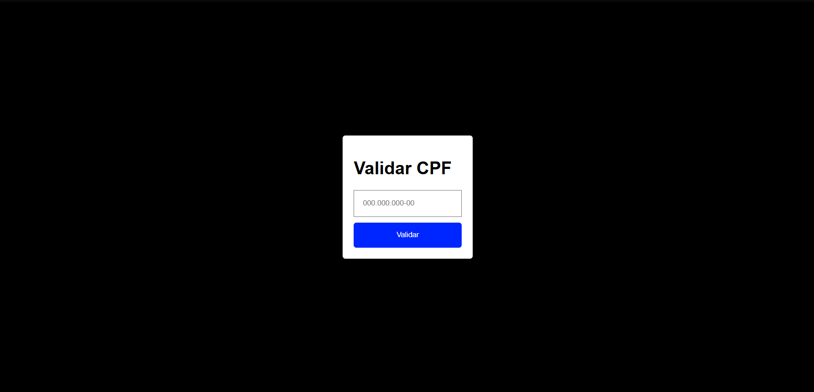

# Validação de CPF

>:white_check_mark: PROJETO FINALIZADO :white_check_mark:

### Tópicos
:triangular_flag_on_post: [Descrição](#descrição)

:triangular_flag_on_post: [Funcionalidades](#funcionalidades)

:triangular_flag_on_post: [Layout](#layout)

:triangular_flag_on_post: [Tecnologias utilizadas](#tecnologias-utilizadas)

:triangular_flag_on_post: [Contribuidores](#contribuidores)

## Descrição
Um validador de CPF, adaptando a lógica de verificação para JavaScript e exibindo mensagens indicando se o CPF é válido ou inválido.

## Funcionalidades
`Funcionalidade 1:` Validação do CPF através da lógica de verificação oficial;

`Funcionalidade 2:` Exibição de mensagens mostrando se o CPF é válido ou inválido.

## Layout

## Tecnologias utilizadas
- `HTML`
  
- `CSS`

- `JavaScript`

## Contribuidores

[ Pedro Aguiar](https://github.com/pmadri)
